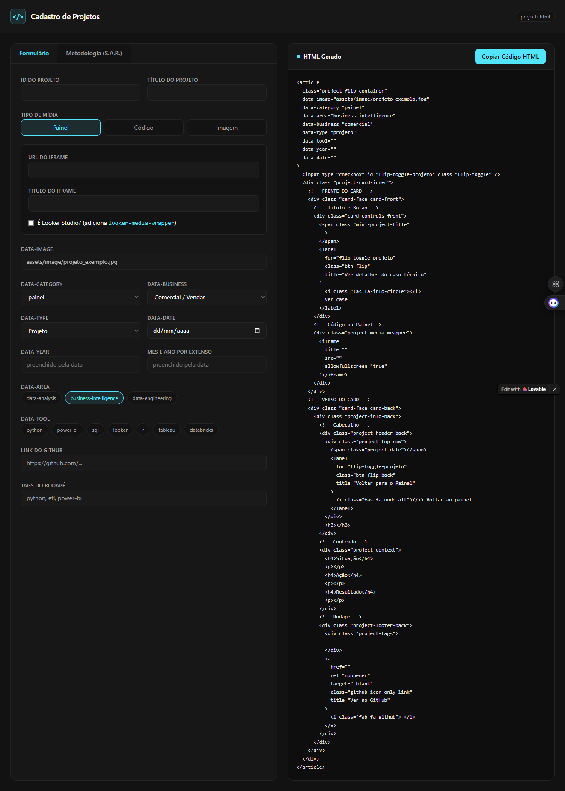

  

  
  |                |                                       |                                              |                               |                                     |
  | -------------- | ------------------------------------- | -------------------------------------------- | ----------------------------- | ----------------------------------- |
  | 🤖 **Gemini**  | 🚀 [Etapa Inicial](#-etapa-inicial)  | 🎨 [Personalização](#-personalização)        | 📥 [Inputs](#-inputs)        | 📄 [Prompt gerado](#-prompt-gerado) |
  | ⚡ **Lovable** | ⚙️ [Automação](#%EF%B8%8F-automação) | 🛠️ [Ajustes finos](#%EF%B8%8F-ajustes-finos) | 📱 [Aplicativo](#-aplicativo) |                                     |

Este projeto foi desenvolvido no Lovable utilizando engenharia de prompt com o Google Gemini para automatizar o fluxo de desenvolvimento. A partir dessa estrutura, o aplicativo gera novos códigos HTML que seguem fielmente a identidade visual, o design e os padrões estruturais já consolidados no meu portfólio pessoal.

## 🤖 Gemini

### 🚀 Etapa inicial

Utilizei o Gemini como engenheiro de prompt para criar um app no Lovable. O objetivo foi elaborar um aplicativo para gerar códigos html apenas preenchendo informações sobre o projeto que eu quero cadastrar em meu portfólio. Compartilhei os códigos dos projetos já cadastrados na página para serem utilizados como base para o aplicativo.

### 🎨 Personalização

Os projetos são semelhantes entre si, mas possuem algumas diferenças e o aplicativo deve identificar isso na geração do código. Além disso, solicitei que o aplicativo tenha as cores do portfólio.

> [!NOTE]
> A diferença principal está na frente do card, que mostra um iframe do Power BI ou iframe do Looker, um código em Python ou SQL ou, até, uma imagem estática.

### 📥 Inputs

Para facilitar o cadastro, o formulário foi desenhado com uma mistura inteligente de campos: inputs de texto livre para os títulos e descrições, caixas de seleção para as ferramentas e menus suspensos para alinhar os metadados exatamente com os filtros do portfólio.

> [!TIP]
> A grande sacada foi a automação de preenchimento: ao definir o título do projeto ou escolher o tipo de mídia, o aplicativo preenche automaticamente outros campos, poupando inputs desnecessários.

O resultado do trabalho com o Gemini foi a criação de um **Prompt Estruturado de Alta Fidelidade para o Lovable**, garantindo que a IA de desenvolvimento low-code compreendesse:

- `Mapeamento estrito de metadados`: Vinculação exata das classes do HTML com os menus de dropdown e filtros existentes no portfólio.
- `Injeção de layout condicional`: Regras para alterar dinamicamente o comportamento da frente e do verso do card dependendo do tipo de projeto.
- `Identidade visual nativa`: Passagem de variáveis de ambiente CSS para que o app gerador nascesse com o visual e design idênticos ao ecossistema do portfólio original.

### 📄 Prompt gerado

Crie um aplicativo web chamado "Cadastro de Projetos" utilizando a paleta de cores fornecida abaixo. O objetivo principal do app é coletar informações de projetos de análise e engenharia de dados através de um formulário interativo e gerar um código HTML padronizado estruturado em cards com efeito de "flip" (frente e verso), pronto para copiar e colar em um arquivo "projects.html".

- Design e cores iguais ao portfólio
- Estrutura do formulário de entrada:
  - Dados de configuração e filtros (classes)
  - Conteúdo do card (tags)
  - Metodologia (situação, ação, resultado)
- Regras de lógica e condicionais para geração do html (ux)
- Interface do usuário (ui)

  <a href="#topo">🔼 Voltar ao topo</a>

## ⚡ Lovable

### ⚙️ Automação

Com a estrutura de dados muito bem definida no prompt inicial, o Lovable criou a primeira versão do app com uma interface dividida: formulário na esquerda e código gerado na direita. A partir daí, o foco foi transformar o aplicativo em uma central de inteligência para que eu não precisasse preencher quase nada manualmente.

Criamos uma rede de automações onde um campo "alimenta" o outro em tempo real:

- `Detecção inteligente de datas:` Ao escolher uma data, o app replica ela nos outros campos de data, cada um com formatação própria.
- `Geração automática de arquivos:` Digitando o ID do projeto, o nome do arquivo de imagem é gerado instantaneamente no padrão do portfólio.
- `Categorização por contexto:` Ao escolher "Código" como mídia, o app marca a categoria como código e a área como data-engineering. Se escolho "Painel" ou "Imagem", ele muda a categoria para painel e marca business-intelligence na área. Além disso, o próprio título do projeto consegue ler palavras-chave e marcar se o tipo é: projeto, case, workshop ou estudo.
- `Sincronização inteligente de tags:` Para evitar erros de digitação nas ferramentas do portfólio, criei uma via de mão dupla. Eu posso digitar as tags no rodapé com letras maiúsculas e espaços, e o aplicativo automaticamente trata esse texto, remove os espaços, coloca em minúsculo e adiciona o hífen para salvar nas classes de filtro.

> [!WARNING]
> A parte de data-tools tem as principais ferramentas que utilizo, então automatizar isso de acordo com as tagsdo rodapé, me permite adicionar habilidades que não estão na lista anterior.

### 🛠️ Ajustes finos

Depois de testar a funcionalidade do aplicativo, fiz uma série de refinamentos visuais e estruturais para que a ferramenta ficasse extremamente rápida e confortável de usar no dia a dia:

- `Limpeza e otimização de espaço:` Removi o bloco de preview visual e desativei as barras de rolagem do formulário. Agora, todo o conteúdo fica visível na tela de uma vez só, apenas alternando da aba de configuração para a de metodologia.
- `Tratamento de texto:` Adicionei uma regra para limpar e remover espaços extras em branco quando colo textos longos nos campos de metodologia, evitando que o HTML gerado fique desalinhado.
- `Fidelidade de código:` Forcei o Lovable a seguir exatamente a árvore de tags do meu portfólio original, organizando o output na ordem exata de componentes.

### 📱 Aplicativo

O resultado final foi um painel de controle minimalista e ultra-focado em produtividade. Limpei a interface removendo subtítulos explicativos e simplificando os rótulos: os campos agora mostram diretamente os nomes técnicos dos atributos e os placeholders foram removidos para deixar o visual o mais limpo possível.

> [!IMPORTANT]
> Os campos da metodologia S.A.R. (Situação, Ação e Resultado) ganharam uma área de texto expandida para facilitar a escrita.

🌐 Clique [aqui](https://project-card-generator.lovable.app/) para acessar o aplicativo em tempo real

  <a href="#topo">🔼 Voltar ao topo</a>

